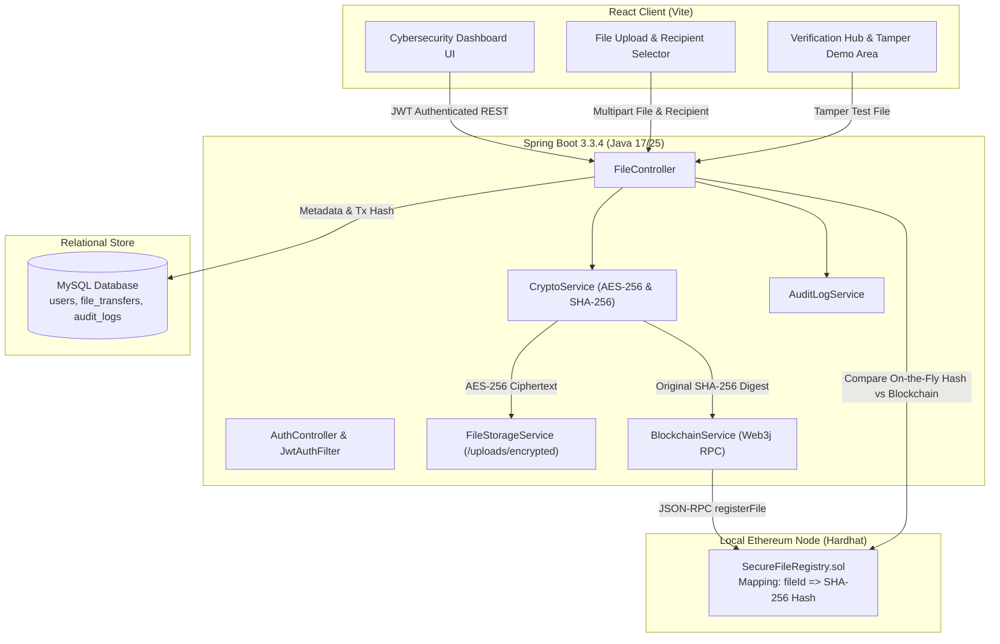

# Blockchain-Based Secure File Transfer Portal

An enterprise-grade, cryptographically backed file transfer portal combining **Spring Boot 3**, **React (Vite)**, **AES-256 Symmetric Encryption**, and an **Ethereum (Hardhat) Smart Contract** for zero-trust file integrity verification and tamper detection.

---

## 🌐 Live Demo & Deployment Links

| Resource | Live Link | Status |
| :--- | :--- | :--- |
| **🚀 Live Demo Website** | [https://frontend-tau-blue-32.vercel.app](https://frontend-tau-blue-32.vercel.app) | **Online (Vercel)** |
| **⚙️ Backend API** | [https://blockchain-file-transfer.onrender.com](https://blockchain-file-transfer.onrender.com) | **Online (Render)** |
| **📊 Render Dashboard** | [https://dashboard.render.com/web/srv-damc9gm1egvs73bmgse0](https://dashboard.render.com/web/srv-damc9gm1egvs73bmgse0) | **Active** |
| **📁 Source Code** | [https://github.com/vinayaktripathi1279/Blockchain-based-file-upload](https://github.com/vinayaktripathi1279/Blockchain-based-file-upload) | **GitHub** |

> **Quick Demo Login:**
> - **User A (Sender):** `alice@example.com` / `password123`
> - **User B (Recipient):** `bob@example.com` / `password123`
> *(One-click fast-fill buttons are also available right on the login page!)*

---

## 🌟 Project Overview

Traditional cloud file transfers rely purely on database records and trusting server operators. If a rogue administrator, compromised disk, or malicious actor alters a stored file, standard systems cannot prove the file was tampered with.

This portal solves that problem by integrating:
1. **AES-256 File Encryption**: Plaintext files are **never** written to disk. All files are encrypted with unique random 16-byte IVs before saving to `/uploads/encrypted/`.
2. **Ethereum Smart Contract Registry**: Every file's original plaintext SHA-256 cryptographic fingerprint is committed immutably to a Solidity smart contract (`SecureFileRegistry.sol`).
3. **Strict Role & Participant Authorization**: Only the authenticated sender or intended recipient can download and decrypt files (unauthorized attempts are blocked with HTTP 403 and logged).
4. **Interactive Tamper Detection Demo**: A dedicated demonstration area where evaluators or interviewers can upload an altered file to visually and mathematically prove that the blockchain catches byte-level tampering!

---

## 🏗️ System Architecture



---

## 🚀 Key Features

| Feature | Description |
| :--- | :--- |
| **JWT Authentication** | Stateless security using HMAC-SHA256 tokens and BCrypt password hashing. |
| **AES-256 Encryption** | Symmetric encryption with dynamically generated Initialization Vectors (IV). Plaintext is never stored on disk. |
| **Solidity Smart Contract** | `SecureFileRegistry.sol` provides immutable, append-only records of file fingerprints. |
| **Role & Transfer Authorization** | Enforces sender/recipient ownership; unauthorized attempts return `HTTP 403 Forbidden`. |
| **Tamper Detection Demo** | Allows uploading an altered file (e.g., modified salary contract) and seeing instant, high-visibility red failure alerts. |
| **Comprehensive Audit Logging** | Security logs for `FILE_UPLOADED`, `FILE_DOWNLOADED`, `UNAUTHORIZED_FILE_ACCESS`, and `TAMPER_TEST_RUN`. |
| **Cybersecurity Dark UI** | Sleek obsidian theme with glowing cyan & emerald accents, responsive data tables, and copyable hashes. |

---

## 🛠️ Technology Stack

- **Backend**: Java 17/25, Spring Boot 3.3.4, Spring Security 6, Spring Data JPA, Web3j 4.10, JJWT 0.12.
- **Frontend**: React 18, Vite, React Router DOM, Axios, Lucide Icons, Vanilla CSS.
- **Blockchain**: Solidity 0.8.20, Hardhat, Ethers.js.
- **Database**: MySQL 8.0 (with configurable environment variables).
- **Cryptography**: AES/CBC/PKCS5Padding (256-bit key), SHA-256, SecureRandom IV.

---

## 📂 Folder Structure Explained in Simple Terms

```
Blockchain based file upload system/
├── backend/                       # Spring Boot Java application
│   ├── src/main/java/com/portal/
│   │   ├── controller/            # REST API endpoints (receives HTTP requests)
│   │   ├── service/               # Business logic (encryption, blockchain calls, file saving)
│   │   ├── repository/            # Database queries (Spring Data JPA)
│   │   ├── entity/                # Database tables (User, FileTransfer, AuditLog)
│   │   ├── dto/                   # Data Transfer Objects (request/response shapes)
│   │   ├── security/              # JWT filters, BCrypt password encoder, security rules
│   │   └── exception/             # Global error handler and custom exception classes
│   ├── src/main/resources/        # application.properties and database configuration
│   └── pom.xml                    # Maven project configuration and dependencies
│
├── blockchain/                    # Ethereum Smart Contract Module
│   ├── contracts/                 # Solidity smart contract (SecureFileRegistry.sol)
│   ├── scripts/                   # Deployment scripts (deploy.js)
│   ├── test/                      # Hardhat tests for smart contract methods
│   └── hardhat.config.js          # Hardhat network configuration
│
├── frontend/                      # React Frontend application
│   ├── src/
│   │   ├── components/            # Reusable UI components (Navbar, ProtectedRoute)
│   │   ├── context/               # AuthContext for managing user login state
│   │   ├── pages/                 # Pages (Dashboard, Upload, Sent, Received, Details, Verify)
│   │   ├── services/              # Axios HTTP client with JWT interceptors
│   │   └── index.css              # Cybersecurity dark theme design system
│   └── package.json               # Frontend dependencies
│
├── uploads/                       # Local file storage
│   └── encrypted/                 # Stored AES-256 ciphertexts (never plaintext)
└── README.md                      # Documentation and run instructions
```

---

## ⚡ How to Run the Project

### Step 1: Database Configuration
Ensure MySQL is running. Set your MySQL credentials in `.env` or set environment variables:
```bash
# Optional: Set environment variables if different from defaults
export DB_HOST=localhost
export DB_PORT=3306
export DB_NAME=file_transfer_db
export DB_USERNAME=root
export DB_PASSWORD=your_mysql_password
```
*(Spring Boot will automatically create the database `file_transfer_db` and all tables on startup).*

---

### Step 2: (Optional) Run Blockchain Node
Open a terminal in `blockchain/`:
```bash
cd blockchain
npm install
npx hardhat node
```
In a second terminal, deploy the smart contract:
```bash
npx hardhat run scripts/deploy.js --network localhost
```
> **Note**: If you run without the Hardhat node, Spring Boot includes a built-in cryptographic fallback registry with mock transaction hashes so you can still test all flows immediately!

---

### Step 3: Run Backend (Spring Boot)
Open a terminal in `backend/`:
```bash
# Using Maven wrapper or installed Maven:
mvn spring-boot:run

# Or on Windows using the provided batch script:
run-backend.bat
```
The backend starts on `http://localhost:8080`.

---

### Step 4: Run Frontend (React)
Open a terminal in `frontend/`:
```bash
cd frontend
npm install
npm run dev
```
Open your browser at `http://localhost:5173`.

---

## 🧪 How to Demo the "Tamper Detection" Feature

When recording a demo or presenting to an interviewer:

1. **Create Two Users**: Register `Alice` (`alice@example.com`) and `Bob` (`bob@example.com`).
2. **Upload a Contract**: Log in as Alice. Go to **Upload File**, select `Bob` as recipient, and upload a text file `contract.txt` containing:
   ```
   Contract: Junior Software Engineer
   Salary: $5,000
   ```
3. **Observe Blockchain Anchor**: The system computes the SHA-256 hash, encrypts the file with AES-256, and commits the hash to the blockchain with a transaction hash.
4. **Simulate an Attack / Tampering**:
   - Open `contract.txt` on your computer and edit the text to:
     ```
     Contract: Junior Software Engineer
     Salary: $9,000
     ```
   - Save the modified file as `contract_tampered.txt`.
5. **Run the Tamper Test**:
   - On the **File Details** page, scroll to the **Tamper Detection Demonstration Area**.
   - Select `contract_tampered.txt` and click **"Run Tamper Test"**.
   - **Result**: The system computes the SHA-256 of the altered file, compares it side-by-side with the immutable blockchain hash, and instantly triggers the giant red pulsing alert:
     > **🚨 INTEGRITY FAILED: This file has been tampered with!**

---

## 📡 REST API Endpoints

### Authentication & Users
- `POST /api/auth/register` - Register a new user (returns JWT)
- `POST /api/auth/login` - Authenticate and obtain JWT
- `GET /api/users/recipients` - List recipients excluding current user
- `GET /api/users/me` - Get current user profile

### File Transfers
- `POST /api/files/upload` - Upload file (multipart), AES-256 encrypt & record on blockchain
- `GET /api/files/sent` - Get all files sent by current user
- `GET /api/files/received` - Get all files received by current user
- `GET /api/files/{id}` - Get file details & blockchain transaction hash
- `GET /api/files/{id}/download` - Decrypt AES-256 ciphertext and stream original file
- `GET /api/files/{id}/verify` - Decrypt, compute SHA-256 and verify against blockchain
- `POST /api/files/{id}/demo-verify` - Tamper Detection Demo endpoint (does NOT save file)
- `GET /api/files/dashboard-stats` - Aggregated transfer metrics

---

## 📸 Screenshots (Placeholder)

| Dashboard Overview | Encrypted File Upload | Tamper Detection Demo |
|:---:|:---:|:---:|
| *[Screenshot: Metrics & Recent Transfers]* | *[Screenshot: Recipient & AES-256 Pipeline]* | *[Screenshot: High-Visibility Tamper Alert]* |
